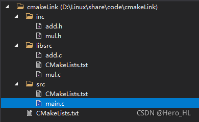
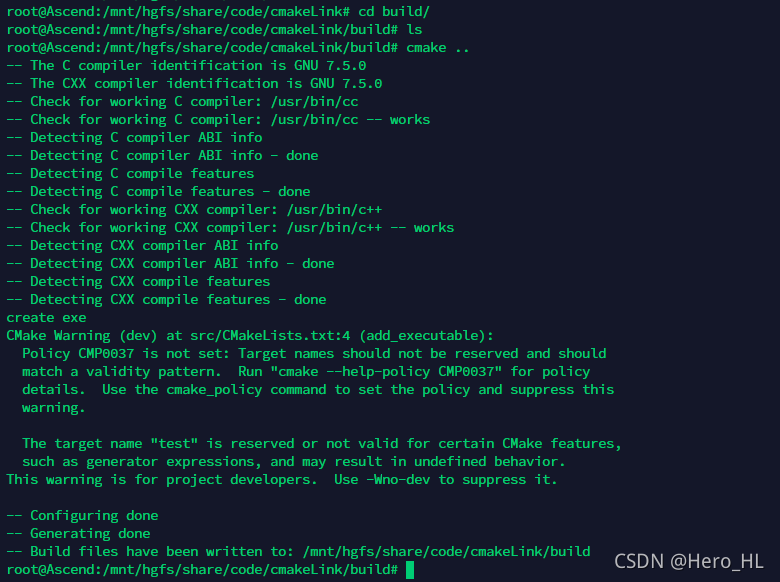
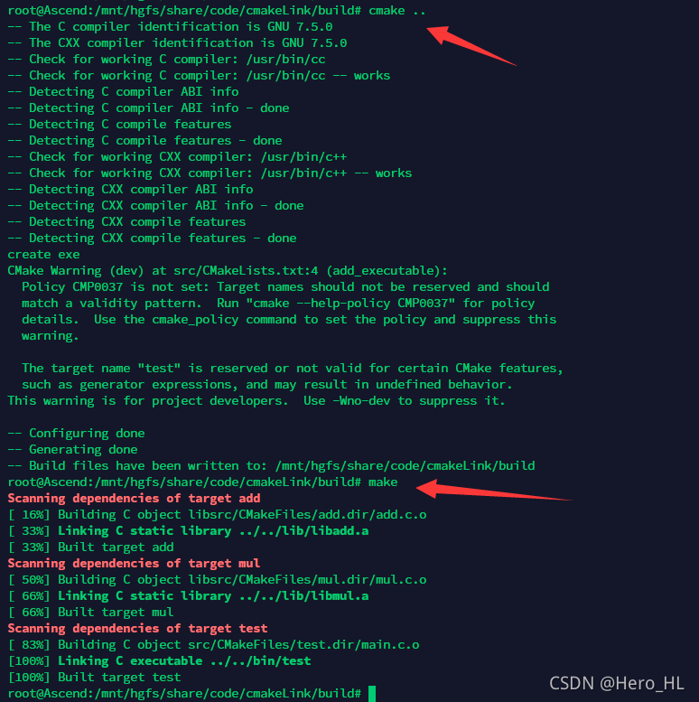
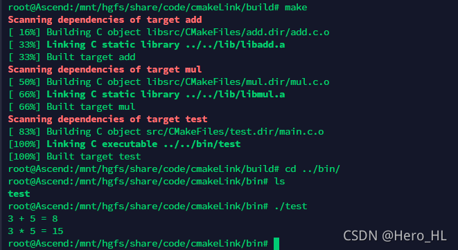

refer：
- [cmake创建库和使用库工程示例（多个cmakelists）](https://blog.csdn.net/hhl_work/article/details/120670486)
- [cmake : add_library详解：](https://blog.csdn.net/LaineGates/article/details/108242803)
- [linux编译命令——make -j8](https://blog.csdn.net/clarkness/article/details/86633681)

使用cmake构建一个工程，该工程创建了两个静态库，另外生成一个引用这两个静态库的可执行文件。

涉及到使用ADD_SUBDIRECTORY实现多个cmakelists的调用。


使用cmake构建一个工程，该工程创建了两个静态库，另外生成一个引用该两个静态库的可执行文件。

# 1.  构建工程


该工程生成两个库liaadd.a和liabmul.a。一个工程管理的cmake，一个生成lib的cmake，一个生成可执行测试程序的cmake。

**文件：add.h**

```c
int add(int a, int b);
```

**文件：add.c**

```c
#include "add.h"

int add(int a, int b)
{
	return a + b;
}
```

**文件：mul.h**

```c
int mul(int a, int b);
```

**文件：mul.c**

```c
#include "mul.h"

int mul(int a, int b)
{
	return a * b;
}
```

**文件：main.c**

```c
#include "add.h"
#include "mul.h"
#include <stdio.h>

int main()
{
	printf("3 + 5 = %d\n", add(3, 5));
	printf("3 * 5 = %d\n", mul(3, 5));
	return 0;
}
```

# 2.  构建编译规则

首先我们要管理整个工程，告诉他目录在哪里，生成库在哪里，生成可执行文件在哪里…然后要去找到子目录在哪里去子目录再找cmake继续编译子目录的库和可执行文件。并且先生成库，再生成可执行文件（可执行文件依赖与这两个库）

## 目录结构

```makefile
CMakeLists-5-Test
├─ CMakeLists.txt
├─ inc
│  ├─ add.h
│  └─ mul.h
├─ libsrc
│  ├─ add.cpp
│  ├─ CMakeLists.txt
│  └─ mul.cpp
├─ readme.assets
├─ readme.md
├─ run.sh
└─ src
   ├─ CMakeLists.txt
   └─ main.cpp

```

## 根目录cmake

（管理整个工程）

```bash
cmake_minimum_required (VERSION 3.5)				# cmake版本最低要求
project (test5)  # 设置工程名称

SET(EXECUTABLE_OUTPUT_PATH ${PROJECT_SOURCE_DIR}/bin)	# 设置可执行文件的输出目录
SET(LIBRARY_OUTPUT_PATH ${PROJECT_SOURCE_DIR}/lib)	# 设置库文件的输出目录

include_directories (${PROJECT_SOURCE_DIR}/inc)		# 添加头文件目录，可以添加多个，或多次添加

# refer：https://www.jianshu.com/p/07acea4e86a3
ADD_SUBDIRECTORY(${PROJECT_SOURCE_DIR}/libsrc)		# 先执行这个目录下的cmake生成静态库
ADD_SUBDIRECTORY(${PROJECT_SOURCE_DIR}/src)			# 在生成库后，此时再链接库生成可执行文件

```

ADD_SUBDIRECTORY就是可以找到子目录，执行子目录的cmake

## libsrc子目录cmake

生成静态库的CMakeLists.txt

```makefile
# 生成静态库，name属性必须全局唯一
add_library(add STATIC ${PROJECT_SOURCE_DIR}/libsrc/add.cpp)
add_library(mul STATIC ${PROJECT_SOURCE_DIR}/libsrc/mul.cpp)

```

## src目录cmake

引用静态库生成可执行文件的CMakeLists.txt

```makefile
# 发现一个目录下所有的源代码文件并将列表存储在一个变量中
aux_source_directory(${PROJECT_SOURCE_DIR}/src SRC_LIST)  # 设置./src为源文件路径

add_executable (test5 ${SRC_LIST})			# 寻找源文件来编译可执行文件
target_link_libraries(test5 
	${PROJECT_SOURCE_DIR}/lib/libadd.a 
	${PROJECT_SOURCE_DIR}/lib/libmul.a)		# 编译时需要链接的静态库

```

# 3. 测试


在工程的根目录下创建构建目录并进入

```bash
mkdir build && cd build
1
```

构建makefile

```bash
cmake ..
1
```


编译 make

进入指定的可执行文件生成目录 project/bin 执行

```bash
cd ../bin
./test
12
```



