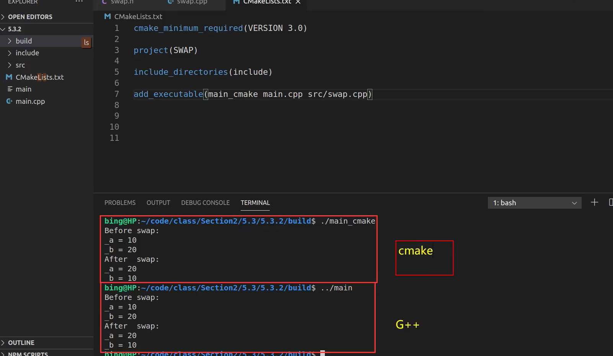

# CMake

## **==cmake_minimum_required== - 指定CMake的最小版本要求**

语法： cmake_minimum_required(VERSION versionNumber [FATAL_ERROR])

```cmake
# CMake最小版本要求为2.8.3
cmake_minimum_required(VERSION 2.8.3)
```

##  **==project== - 定义工程名称，并可指定工程支持的语言**

语法： project(projectname [CXX] [C] [Java])

```cmake
#可以用来指定工程的名字和支持的语言，默认支持所有语言

PROJECT (HELLO)   指定了工程的名字，并且支持所有语言—建议

PROJECT (HELLO CXX)      指定了工程的名字，并且支持语言是C++

PROJECT (HELLO C CXX)      指定了工程的名字，并且支持语言是C和C++**

该指定隐式定义了两个CMAKE的变量
<projectname>_BINARY_DIR，本例中是 HELLO_BINARY_DIR
<projectname>_SOURCE_DIR，本例中是 HELLO_SOURCE_DIR
**MESSAGE关键字就可以直接使用者两个变量，当前都指向当前的工作目录**，后面会讲外部编译
问题：如果改了工程名，这两个变量名也会改变
解决：又定义两个预定义变量：**PROJECT_BINARY_DIR和PROJECT_SOURCE_DIR**，这两个变量和HELLO_BINARY_DIR，HELLO_SOURCE_DIR是一致的。所以改了工程名也没有关系
```


## **==set==- 显式的定义变量**

语法：set(VAR [VALUE] [CACHE TYPE DOCSTRING [FORCE]])   **如果源文件名中含有空格，就必须要加双引号**

```cmake
# 定义SRC变量，其值为sayhello.cpp hello.cpp

set(SRC sayhello.cpp hello.cpp)
```


## **==include_directories== - 向工程添加多个 ==特定的头文件== 搜索路径 --->相当于指定g++编译器的-I参数**

语法： include_directories([AFTER|BEFORE] [SYSTEM] dir1 dir2 ...)

```cmake
# 将/usr/include/myincludefolder 和  ./include 添加到头文件搜索路径

include_directories(/usr/include/myincludefolder ./include)

```

```c++
├── CMakeLists.txt    #最外层的CMakeList.txt
├── main.cpp    #源文件，包含被测试的头文件
├── sub    #子目录
 └── test.h    #测试头文件，是个空文件，被外层的main,cpp包含

场景2：使用include_directories包含子目录sub,并在main.cpp里面包含"test.h"。

# CMakeList.txt
cmake_minimum_required(VERSION 3.18.2)
project(include_directories_test)
include_directories(sub)        #与上个场景不同的地方在于此处
add_executable(test main.cpp)
    
    
//main.cpp
#include "test.h"
#include <stdio.h>
int main(int argc, char **argv)
{
    printf("hello, world!\n");
    return 0;

```


## ==link_directories== - 向工程添加多个 ==特定的库文件== 搜索路径 --->相当于指定g++编译器的-L参数

语法： link_directories(dir1 dir2 ...)

```cmake
# 将/usr/lib/mylibfolder 和 ./lib 添加到库文件搜索路径

link_directories(/usr/lib/mylibfolder ./lib)
```


## **==add_library== - 生成库文件**

语法： add_library(libname [SHARED|STATIC|MODULE] [EXCLUDE_FROM_ALL]source1 source2 ... sourceN)

```cmake
# 通过变量 SRC 生成 libhello.so 共享库

add_library(hello SHARED ${SRC})
```

ADD_LIBRARY(hello SHARED ${ LIBHELLO_SRC})

- hello：就是正常的库名，生成的名字前面会加上lib，最终产生的文件是libhello.so
- **SHARED，动态库    STATIC，静态库**
- ${LIBHELLO_SRC} ：**源文件**


### **构建实例**

任务：

１，建立一个静态库和动态库，提供 HelloFunc 函数供其他程序编程使用，HelloFunc 向终端输出 Hello World 字符串。 

２，安装头文件与共享库。


**看code   构建静态和动态库**


### 1. 构建静态和动态库

```cpp
[root@localhost cmake2]# tree
.
├── build
├── CMakeLists.txt
└── lib
    ├── CMakeLists.txt
    ├── hello.cpp
    └── hello.h
```

hello.h中的内容

```cpp
#ifndef HELLO_H
#define Hello_H

void HelloFunc();

#endif
```

hello.cpp中的内容

```cpp
#include "hello.h"
#include <iostream>
void HelloFunc(){
    std::cout << "Hello World" << std::endl;
}
```

项目中的cmake内容

```cpp
PROJECT(HELLO)
ADD_SUBDIRECTORY(lib bin)
```

lib中CMakeLists.txt中的内容

```cpp
SET(LIBHELLO_SRC hello.cpp)
ADD_LIBRARY(hello SHARED ${LIBHELLO_SRC})
```

**自动生成在 build/bin(自动创建的) 中**

- **hello：就是正常的库名，生成的名字前面会加上lib，最终产生的文件是libhello.so**

- SHARED，动态库    STATIC，静态库

- ${LIBHELLO_SRC} ：源文件

  

----------------


**同时构建静态和动态库**

用到  SET_TARGET_PROPERTIES

这条指令可以用来设置输出的名称，对于动态库，还可以用来指定动态库版本和 API 版本

同时构建静态和动态库

lib中CMakeLists.txt中的内容:

```cmake
SET(LIBHELLO_SRC hello.cpp)

// 静态
ADD_LIBRARY(hello_static STATIC ${LIBHELLO_SRC})
//对hello_static的重名为hello
SET_TARGET_PROPERTIES(hello_static PROPERTIES  OUTPUT_NAME "hello")
//cmake 在构建一个新的target 时，会尝试清理掉其他使用这个名字的库，因为，在构建 libhello.so 时， 就会清理掉 libhello.a
SET_TARGET_PROPERTIES(hello_static PROPERTIES CLEAN_DIRECT_OUTPUT 1)


// 动态
ADD_LIBRARY(hello SHARED ${LIBHELLO_SRC})
SET_TARGET_PROPERTIES(hello PROPERTIES  OUTPUT_NAME "hello")
SET_TARGET_PROPERTIES(hello PROPERTIES CLEAN_DIRECT_OUTPUT 1)
```


**动态库的版本号**

一般动态库都有一个版本号的关联

```cpp
libhello.so.1.2
libhello.so ->libhello.so.1
libhello.so.1->libhello.so.1.2
```

CMakeLists.txt 插入如下

`SET_TARGET_PROPERTIES(hello PROPERTIES VERSION 1.2 SOVERSION 1)`

VERSION 指代动态库版本，SOVERSION 指代 API 版本


### 2. 安装头文件 和 共享库

动态库和静态库需要安装头文件

将在lib里的 hello.h   安装到 usr/include/hello 目录


给动态库和静态库需要安装头文件.  将 hello 的共享库安装到 usr/lib目录，

lib中的继续添加cmake内容


```cpp
//文件放到该目录下
INSTALL(FILES hello.h DESTINATION include/hello)
    //这里的include应该是自动创建在当前Cmakelist所在目录

//二进制，静态库，动态库安装都用TARGETS
//ARCHIVE 特指静态库，LIBRARY 特指动态库，RUNTIME 特指可执行目标二进制。
INSTALL(TARGETS hello hello_static LIBRARY DESTINATION lib ARCHIVE DESTINATION lib)
```

注意：

安装的时候，指定一下路径，放到系统下

在build下:

`cmake -D CMAKE_INSTALL_PREFIX=/usr ..`

**具体过程**


### **3. 使用**

新建一个目录来使用外部共享库和头文件

```cpp
[root@MiWiFi-R4CM-srv cmake3]# tree
.
├── build
├── CMakeLists.txt
└── src
    ├── CMakeLists.txt
    └── main.cpp
```

main.cpp

```cpp
#include <hello.h>          // 使用动态库

int main(){
	HelloFunc();            // 使用动态库
}
```

src里的camke

```cmake
INCLUDE_DIRECTORIES(/usr/include/hello)   // 动态库的头文件

ADD_EXECUTABLE(hello main.cpp)

TARGET_LINK_LIBRARIES(hello libhello.so)  //动态库的lib文件
```

项目下的:

```cmake
PROJECT(HELLO)

CMAKE_MINIMUM_REQUIRED(VERSION 2.8.3)

ADD_SUBDIRECTORY(src bin)
```


解决:

```linux
mv /usr/lib/libhello.so /usr/lib64/
```


---------

## ==add_compile_options== - 添加编译参数

语法：add_compile_options(

```cmake
# 添加编译参数 -Wall -std=c++11 -O2

add_compile_options(-Wall -std=c++11 -O2)
```


## ==add_executable==- 生成可执行文件

语法：add_executable(exename source1 source2 ... sourceN)

```cmake
# 编译main.cpp  生成 可执行文件main

add_executable(main main.cpp)
```

  **生成的可执行文件名是hello，源文件读取变量SRC_LIST中的内容** 注意：**工程名的 HELLO 和生成的可执行文件 hello 是没有任何关系的**

也可以直接写 ADD_EXECUTABLE(hello main.cpp)


## ==target_link_libraries== - 为 target 添加需要链接的共享库 --->相同于指定g++编译器-l参数

语法： target_link_libraries(target library1<debug | optimized> library2...)

```cmake
# 将hello动态库文件链接到可执行文件main

target_link_libraries(main hello)    //hello是生成的库文件
```


## ==add_subdirectory== - 向当前工程添加存放源文件的子目录，指定 中间 和 目标的二进制存放的位置

语法： add_subdirectory(source_dir [binary_dir] [EXCLUDE_FROM_ALL])

\#添加包含CMakeLists.txt和源文件的子目录 ---> 相当于把整个文件变成一个.cpp文件

```cmake
# 添加src子目录，src中需有一个CMakeLists.txt

add_subdirectory(src)
```

**ADD_SUBDIRECTORY(src bin)**

**将 src 子目录加入工程并指定编译输出(包含编译中间结果)路径为bin 目录**

如果不进行 bin 目录的指定，那么编译结果(包括中间结果)都将存放在build/src 目录


## ==aux_source_directory== - 发现一个目录下所有的源代码文件并将列表存储在一个变量中，这个指令临时被用来自动构建源文件列表

 语法： aux_source_directory(dir VARIABLE)

```cmake
# 定义SRC变量，其值为当前目录下所有的源代码文件
aux_source_directory(. SRC)

# 编译SRC变量所代表的源代码文件，生成main可执行文件

add_executable(main ${SRC})
```

-------------


 `aux_source_directory（目录 存放文件列表的变量）`

例如我们想搜索当前目录下的所有cpp则为

aux_source_directory(. CPP_LIST)

但是这个命令只会仅仅搜索当前目录下的文件（即tool2.cpp），tool1目录中无法搜索到，有两种解决办法：

1:再增加一个aux_source_directory(./tool1 CPP_LIST2)，即可成功编译


2.使用cmake单独将tool1文件夹编译为一个so

具体步骤：

1.在tool1文件夹中新建一个CMakeLists.txt ,其中内容为：

```cmake
aux_source_directory(. tool1_file) #查找当前目录下的tool1相关文件

add_library(tool1lib ${tool1_file})   #将他们编译为一个叫tool1lib的文件
```

2.主目录的cmakelists修改为：

```bash
cmake_minimum_required(VERSION 2.6)  #指定cmake最低版本为2.6
 
project(FirstCmakeDemo)  #指定工程名称
aux_source_directory(. CPP_LIST)  #搜索当前目录下的所有cpp文件
add_subdirectory(tool1)           #将tool1文件夹加入子目录,这样他就可以去tool1文件夹中查找编译
 
add_executable(out_file ${CPP_LIST}) #生成目标文件
 
target_link_libraries(out_file tool1lib)
#添加链接库,其库的名字由tool1文件夹中的CMakeLists.txt来指定生成
```


##  CMake常用变量

+ **CMAKE_C_FLAGS gcc编译选项**                 // c语言

+ **CMAKE_CXX_FLAGS g++编译选项**             // c++

```cmake
# 在CMAKE_CXX_FLAGS编译选项后追加-std=c++11

set( CMAKE_CXX_FLAGS "${CMAKE_CXX_FLAGS} -std=c++11")
```


+ **CMAKE_BUILD_TYPE 编译类型(Debug, Release)**

```cmake
# 设定编译类型为debug，调试时需要选择debug

set(CMAKE_BUILD_TYPE Debug)

# 设定编译类型为release，发布时需要选择release

set(CMAKE_BUILD_TYPE Release)
```

​        CMAKE_BINARY_DIR

+ **PROJECT_BINARY_DIR**
  _BINARY_DIR

1. 这三个变量指代的内容是一致的。

2. 如果是 in source build，指的就是工程顶层目录。

3. 如果是 out-of-source 编译,指的是工程编译发生的目录。

4. PROJECT_BINARY_DIR 跟其他指令稍有区别，不过现在，你可以理解为他们是一致
    的。
    
    

​        CMAKE_SOURCE_DIR

+ **PROJECT_SOURCE_DIR**
  _SOURCE_DIR

6. 这三个变量指代的内容是一致的,**不论采用何种编译方式,都是工程顶层目录。**
7. 也就是在 in source build时,他跟 CMAKE_BINARY_DIR 等变量一致。
8. PROJECT_SOURCE_DIR 跟其他指令稍有区别,现在,你可以理解为他们是一致的。


CMAKE_C_COMPILER：指定C编译器
CMAKE_CXX_COMPILER：指定C++编译器
EXECUTABLE_OUTPUT_PATH：可执行文件输出的存放路径
LIBRARY_OUTPUT_PATH：库文件输出的存放路径


## CMake编译工程

CMake目录结构：项目主目录存在一个CMakeLists.txt文件
两种方式设置编译规则：

1. 包含源文件的子文件夹包含CMakeLists.txt文件，主目录的CMakeLists.txt通过add_subdirectory
添加子目录即可；
2. 包含源文件的子文件夹未包含CMakeLists.txt文件，子目录编译规则体现在主目录的
CMakeLists.txt中；
6.4.1 编译流程
在 linux 平台下使用 CMake 构建C/C++工程的流程如下:
手动编写 CMakeLists.txt。
执行命令 cmake PATH 生成 Makefile ( PATH 是顶层CMakeLists.txt 所在的目录 )。
执行命令make 进行编译。
6.4.2 两


## 内部构建和外部构建


**内部构建:** 


cmake .


make


-------------


**外部构建** :

进入build文件    camke ..

cmake 点点”表示在上一级目录(CMakeLists.txt所在目录)编译


### 外部构建

将编译输出文件与源文件放到不同目录中

```cmake
## 外部构建
# 1. 在当前目录下，创建build文件夹
mkdir build
# 2. 进入到build文件夹
cd build
# 3. 编译上级目录的CMakeLists.txt，生成Makefile和其他文件
cmake ..
# 4. 执行make命令，生成target
make
```


make


把所有生成文件都放在build目录中


**多文件**





例子2: 


------

### 配置VSCode的json文件并调试项目

xiaobing


### 多文件编译


看文件  mutil

```cmake
cmake_minimum_required(VERSION 3.0)

project(MUTIL)

#设置hello world 给环境变量TARGET
set(TARGET helloworld)

#添加头文件              -- 有.h的地方
include_directories(
    hello
    world
)

#添加包含CMakeLists.txt和源文件的子目录
add_subdirectory(hello)
add_subdirectory(world)

aux_source_directory(. DIRSRCS)

#生成可执行文件
add_executable(${TARGET} ${DIRSRCS})

#helloworld 链接静态库hello和world
target_link_libraries(${TARGET}  hello world)
```


```cmake
#把指定目录下所有源代码和头文件文件入变量DIR_HELLO    “.”是指cmakelists文件当前目录
aux_source_directory(. DIR_HELLO)

#从${DIR_HELLO}文件中生成hello库, STATIC是生成静态库
add_library(hello STATIC ${DIR_HELLO})
```


```cmake
aux_source_directory(. DIR_WORLD)

add_library(world STATIC ${DIR_WORLD})
```


案例2

```
SheepMarket
├─ .vscode
│  ├─ c_cpp_properties.json
│  ├─ launch.json
│  ├─ settings.json
│  └─ tasks.json
├─ build
│  ├─ fontcolor.exe
│  ├─ init.exe
│  ├─ main.exe
│  └─ menu.exe
├─ CMakeLists.txt
├─ include
│  ├─ Administrator.h
│  ├─ consumer .h
│  ├─ fontcolor.h
│  ├─ init.h
│  ├─ menu.h
│  └─ system.h
├─ src
├  ├─ CMakeLists.txt
│  ├─ Administrator.cpp
│  ├─ consumer .cpp
│  ├─ fontcolor.cpp
│  ├─ init.cpp
│  ├─ main.cpp
│  ├─ menu.cpp
│  └─ system.cpp
└─ 功能总览.md
```


```cmake
cmake_minimum_required(VERSION 3.0)
project(SHEEPMARKET)

set(TARGET main)

include_directories(${PROJECT_SOURCE_DIR}/include)
aux_source_directory(. DIRSRC)

add_subdirectory(${PROJECT_SOURCE_DIR}/src)

add_executable(${TARGET} ${DIRSRC})


target_link_libraries(${TARGET} src)

```


```cmake
aux_source_directory(. DIRSRCS)
/include_directories(${PROJECT_SOURCE_DIR}/include)
add_library(src STATIC ${DIRSRCS})
```


### CMake入门到精通实战
